---

# 🕶️ About Me

> "Live your life hard-boiled."

Hi, I'm **Vannnn793** — a Backend-Oriented Developer who builds structured systems, clean logic, and reliable foundations.

I believe great software starts behind the scenes.
For me, code isn’t just syntax — it’s architecture, flow, and execution.

---

# 🎯 Identity

* 🖥️ Primary Role: Backend Developer
* 🧠 Focus: System Logic & Data Flow
* ⚙️ Core Weapon: PHP & JavaScript
* 🗄️ Backend Strength: Server Logic & Dynamic Processing
* 🌪️ Frontend Capability: Clean UI Implementation (HTML, CSS, JS)
* 📚 Currently Leveling Up: Advanced Backend Patterns & Scalable Architecture

---

# 🛠️ Tech Stack

## 🟣 Core System Side (Backend Focus)

* PHP (Dynamic Backend Handling)
* JavaScript (Logic Flow & Functional Structure)
* Data Processing & Server-Side Logic
* Basic MVC Understanding

## 🌪️ Interface Side (Supporting Frontend)

* HTML5
* CSS3
* Responsive Layout
* DOM Manipulation

---

# 🗂️ Selected Projects

### 🟣 Dynamic System Project

Backend-driven interactive system
`PHP` `JavaScript` `HTML` `CSS`
[Repository →](https://github.com/Vannnn793/kampusgw)

---

# 🏆 Milestones

* ✅ Built first dynamic backend-powered project
* ✅ Implemented server-side logic handling
* 🔄 Currently improving system structure & scalability
* 🎯 Target: Deploy full-stack production-ready project

---

# 🚀 What I Bring

✔ Structured and maintainable backend logic
✔ Clean and readable code architecture
✔ Balanced system thinking (logic + interface)
✔ Continuous improvement mindset
✔ Hard-boiled execution style

---

# 📂 Current Focus

Right now I’m diving deeper into:

* Advanced PHP architecture
* Scalable backend structure
* Cleaner and modular code design
* Improving API & data flow handling
* Strengthening problem-solving through system logic

---

# 📊 GitHub Stats

  
   
  

---

# 🧭 Philosophy

> Build the system right.
> Execute with precision.
> Let the logic speak.

---

# 📬 Connect With Me

* GitHub: [https://github.com/Vannnn793](https://github.com/Vannnn793)
* Instagram: @darfan_ml
* Tiktok: @darfan_dragneel
* LinkedIn: [https://www.linkedin.com/in/arfan-dragneel-47b02b385/](https://www.linkedin.com/in/arfan-dragneel-47b02b385/)

---
